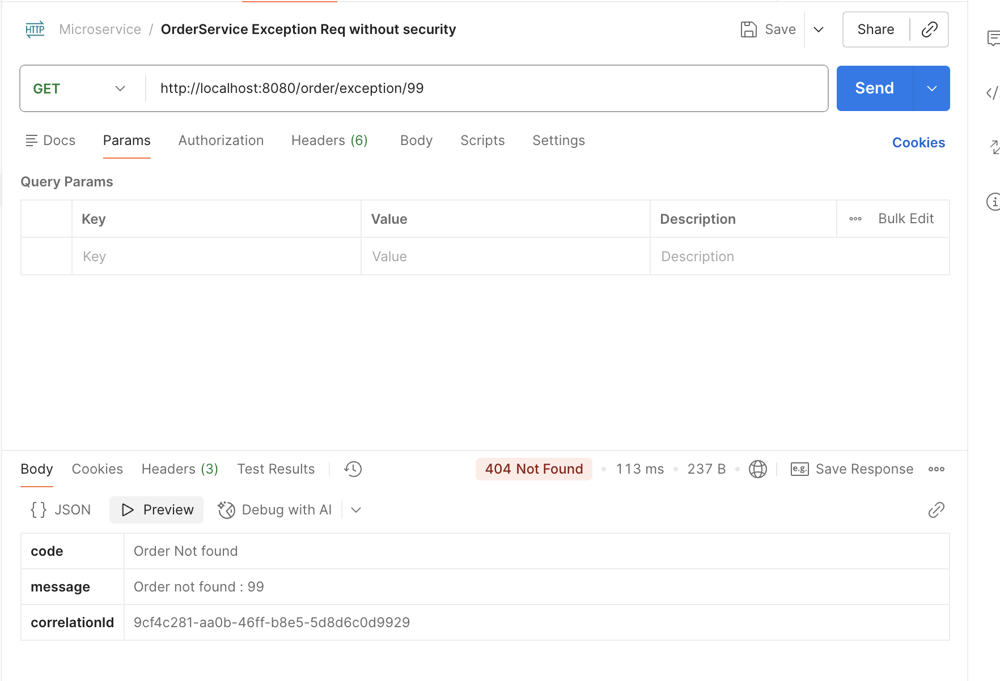
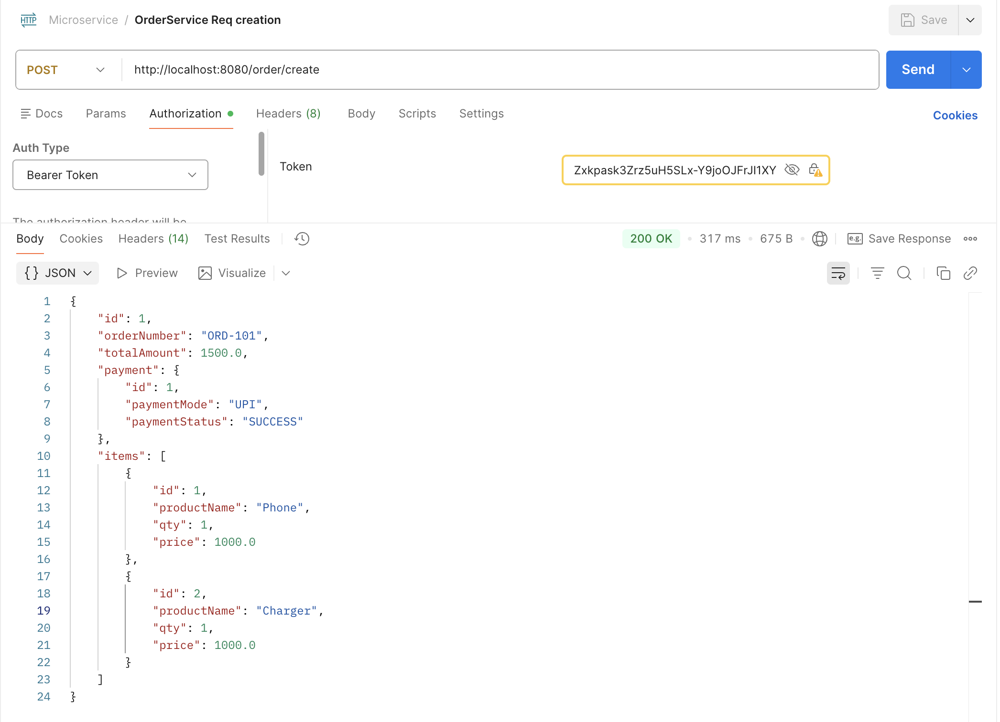
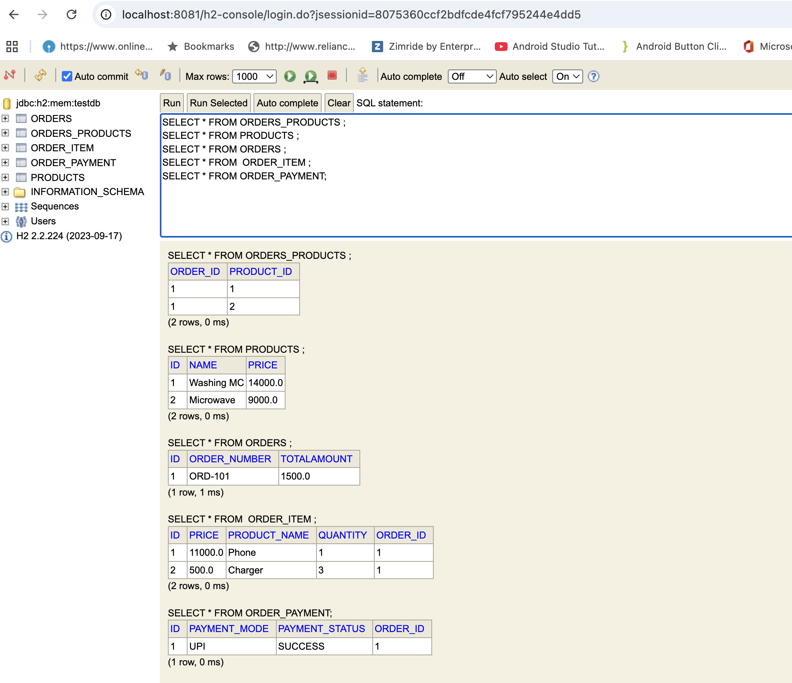

# Microservices Architecture with Eureka Server and JWT Authentication

## 📌 Project Overview
This project follows a **Microservices Architecture** using **Spring Boot** and **Spring Cloud**.  
It uses:
- **Eureka Server** for service discovery
- **Auth Service** for authentication and JWT token generation
- **API Gateway** for routing and security enforcement

All secured requests use **JWT Bearer Tokens**.

---

## 🧩 Microservices Architecture Flow (with Auth & JWT)

```text
Client (Web / Mobile)
        |
        | 1. Login Request (username/password)
        v
-----------------------
|   Auth Service      |
|  (JWT Generator)   |
-----------------------
        |
        | 2. JWT Token
        v
Client (stores token)
        |
        | 3. Request with Header:
        |    Authorization: Bearer <JWT>
        v
-----------------------
|   API Gateway      |
-----------------------
        |
        | 4. Token Validation
        v
-----------------------
|   Eureka Server    |
-----------------------
        |
        v
------------------------------------------------
| Order Service | Payment Service | Inventory  |
| Notification Service                          |
------------------------------------------------
        |
        v
   Database (per service)
```
---
- **Lombok** generates mutable classes and hides behavior through annotations.
- **Records** are part of the Java language, immutable by default, and safer for concurrent systems.

---
## Exception Handler


## Hibernate Mapping
OneToOne OneOrder->OnePayment 
OneToMany OneOrder->ManyItems

Order - inverse side,mappedBy=<FK name>
Payment - Owning side with FK
Items -Owning side with FK

Infinite recursion happens when Jackson serializes bidirectional JPA relationships.
The fix is to control JSON serialization using @JsonManagedReference and @JsonBackReference, or better, return DTOs instead of entities.
## DTO
We never expose entities directly. We use DTOs to avoid recursion, lazy loading issues, and overfetching.



### SQL queries forming:
Hibernate: insert into orders (order_number,totalamount,id) values (?,?,default)
Hibernate: insert into order_item (order_id,price,product_name,quantity,id) values (?,?,?,?,default)
Hibernate: insert into order_item (order_id,price,product_name,quantity,id) values (?,?,?,?,default)
Hibernate: select next value for order_payment_seq
Hibernate: insert into order_payment (order_id,payment_mode,payment_status,id) values (?,?,?,?)

To check on h2 DB
http://localhost:8081/h2-console



### BookMarks
http://localhost:8080/order/19 -from gateway
http://localhost:8761/ -eureka
https://github.com/in28minutes/spring-microservices-v3/blob/main/03.microservices/api-gateway/pom.xml
http://localhost:8081/h2-console -H2
http://localhost:8081/h2-console/login.do?jsessionid=93e0ac27f28974b6860aed21ea2f154f

### Why we use mappedBy?
mappedBy is used on the inverse (non-owning) side of a bidirectional relationship to tell 
JPA that the relationship is already managed by the owning side, 
and to prevent creation of an extra join table or foreign key.

#### Diagram

                                   ┌──────────────────┐
                                   │     PRODUCT     │
                                   │------------------│
                                   │ product_id (PK) │
                                   │ name            │
                                   └─────────▲────────┘
                                             │  M:N  (inverse side)
                                             │  @ManyToMany(mappedBy="products")
                                             │
                                     ┌───────┴─────────────────────┐
                                     │       ORDERS_PRODUCTS       │  <-- JOIN TABLE
                                     │-----------------------------│
                                     │ order_id   (FK)  ───────────┘
                                     │ product_id (FK)  ───────────────┐
                                     └───────────────────────────────┘
                                                ▲
                                                │  M:N (OWNING SIDE)
                                                │  @ManyToMany + @JoinTable
                                                │
                    ┌─────────────────────────────────────────────────────────┐
                    │                         ORDER                           │
                    │---------------------------------------------------------│
                    │ order_id (PK)                                          │
                    │ order_number                                           │
                    │ total_amount                                           │
                    │                                                         │
                    │ 1:1 (INVERSE SIDE)      1:N (INVERSE SIDE)     M:N (OWNING) │
                    │ @OneToOne(mappedBy)     @OneToMany(mappedBy)    @ManyToMany │
                    │                                                         │
                    └───────▲───────────────────────▲───────────────────────┘
                            │                       │
            1:1 (OWNING)    │                       │   1:N (OWNING)
       @OneToOne + @JoinColumn                    @ManyToOne + @JoinColumn
                            │                       │
                    ┌───────┴──────────────┐   ┌───┴──────────────────────┐
                    │    ORDER_PAYMENT     │   │       ORDER_ITEM         │
                    │----------------------│   │--------------------------│
                    │ payment_id (PK)     │   │ item_id (PK)              │
                    │ status              │   │ product_name               │
                    │ amount              │   │ price                     │
                    │ order_id (FK, UNIQUE)│  │ order_id (FK)             │
                    └─────────────────────┘   └──────────────────────────┘

```
```
### Rules:
| Mapping          | Owning Side                    | Where `mappedBy` goes |
| ---------------- | ------------------------------ | --------------------- |
| **One-to-One**   | Side with FK                   | Other side            |
| **One-to-Many**  | **MANY side**                  | On ONE side           |
| **Many-to-Many** | Your chosen side (e.g., Order) | Other side            |
